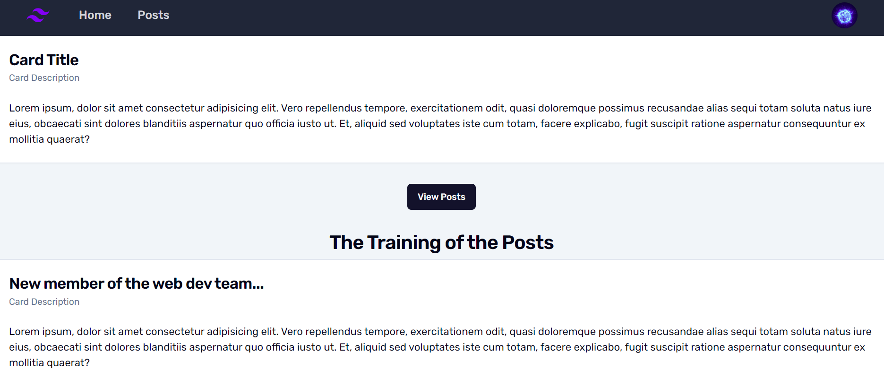
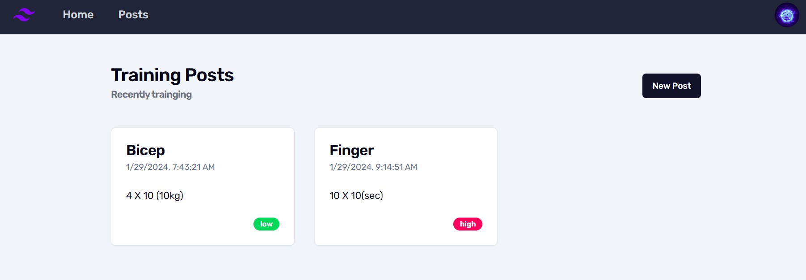
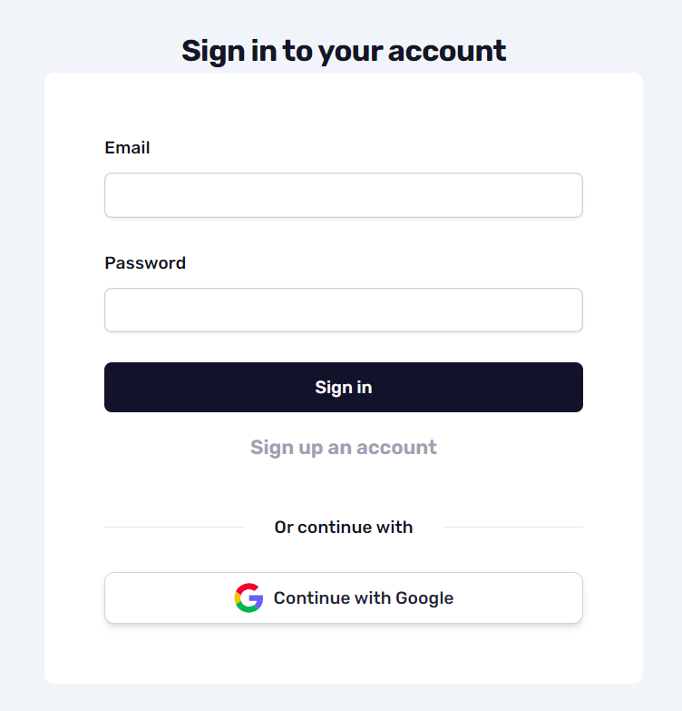
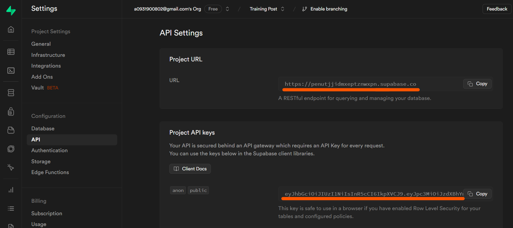
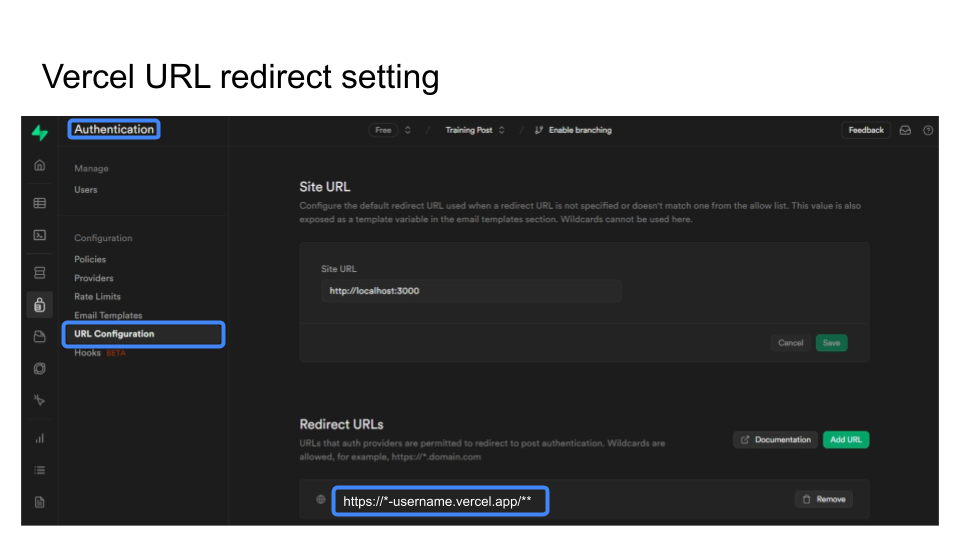
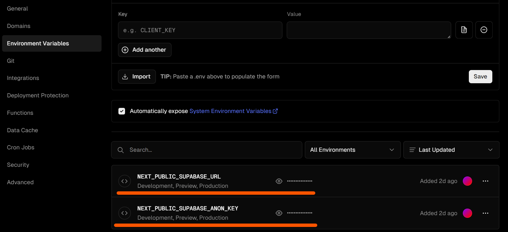

[demo](https://create-post-by-next13-4-gmb9h7wxp-marcoliu1020.vercel.app/)

## How to start
1. 創建 Supabase 帳號
2. 創建 Vercel 帳號 (如果要部署到網路上)
3. 創建 Google 帳號 (如果要使用 OAuth 第三方登入)
   - [How to add Google OAuth Logins to your Supabase Application](https://supabase.com/docs/guides/auth/auth-deep-dive/auth-google-oauth)

## Getting Started
- 本機測試環境
    1. `npm install`
    2. `npm run dev`
    3. .env.local setting
    4. Open [http://localhost:3000](http://localhost:3000) with your browser to see the result.

## .env.local setting
- 更改名稱 `.example.env.local` to `.env.local`
- 填寫參數
  1. `NEXT_PUBLIC_SUPABASE_URL`=https://xxx.supabase.co
     - Supabase Project URL
     
    
  2. `NEXT_PUBLIC_SUPABASE_ANON_KEY`=eyJh5cCIJ9.eyJpc3Mk2MH0.ldHnVnoFwV
     - Supabase Anon Key
  3. `NEXT_PUBLIC_SITE_URL`=https://xxxxxxxxxxxxx.vercel.app
     - 網路上的正式網址，如果沒有可以先不輸入

## Supabase redirect URL setting for Vercel
- 將專案部署到 Vercel，並且有使用 Google 第三方帳號登入，就要設定轉址服務
- 新增 `https://*-username.vercel.app/`，username 是 Vercel 的 username

## Vercel env setting
需要額外手動加入 .env.local 的 2 個參數到 Vercel 的專案裡，不然 Vercel 編譯會失敗
1. NEXT_PUBLIC_SUPABASE_URL
2. NEXT_PUBLIC_SUPABASE_ANON_KEY
 

