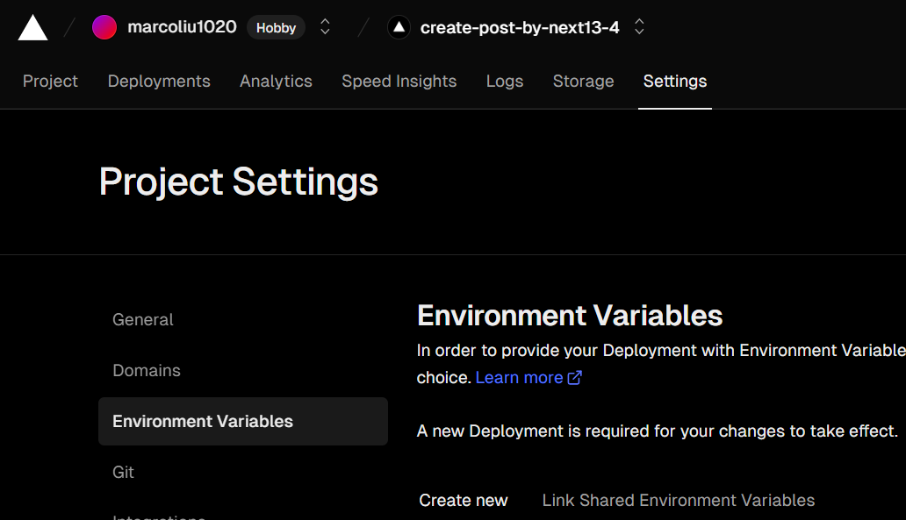
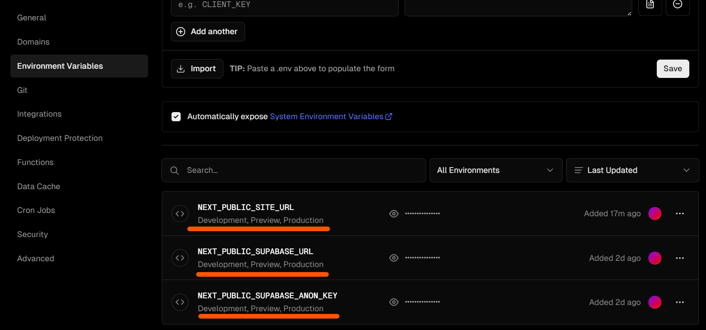
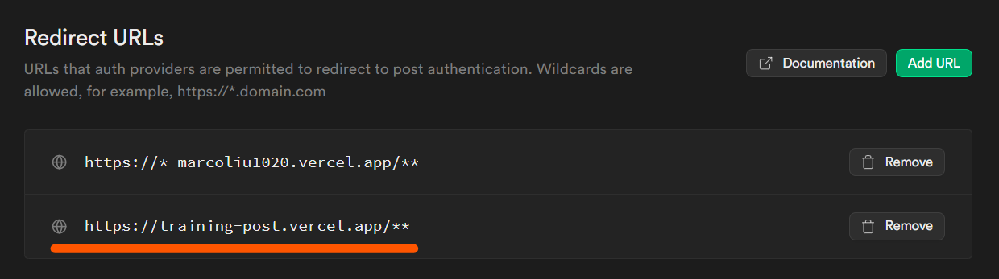

## About The Project

 
有註冊帳號才能發布文章的平台

[demo](https://training-post.vercel.app/)

## Built With
1. [Next](https://nextjs.org/)
   - 網站建立
2. [Supabase](https://supabase.com/)
   - 資料庫
   - 身分驗證
3. [Vercel](https://vercel.com/)
   - 網站部署
4. [shadcn/ui](https://ui.shadcn.com/)
   - UI components
5. Goolge OAuth

## How to start
1. 創建 Supabase 帳號
2. 創建 Vercel 帳號 (如果要部署到網路上)
3. 創建 Google 帳號 (如果要使用 OAuth 第三方登入)
   - [How to add Google OAuth Logins to your Supabase Application](https://supabase.com/docs/guides/auth/auth-deep-dive/auth-google-oauth)

## Getting Started
- 本機測試環境
    1. `npm install`
    2. `npm run dev`
    3. [.env.local setting](#envlocal-setting)
    4. Open [http://localhost:3000](http://localhost:3000) with your browser to see the result.

## .env.local setting
1. 更改名稱 `.example.env.local` to `.env.local`
2. 填寫參數
   1. `NEXT_PUBLIC_SUPABASE_URL`=https://xxx.supabase.co
      - Supabase Project URL
   2. `NEXT_PUBLIC_SUPABASE_ANON_KEY`=eyJh5cCIJ9.eyJpc3Mk2MH0.ldHnVnoFwV
      - Supabase Anon Key
   3. `NEXT_PUBLIC_SITE_URL`=https://xxxxxxxxxxxxx.vercel.app
      - 網路上的正式網址，如果沒有可以先不輸入

- Supabase Project URL & Anon Key
 

## Vercel env setting
需要額外手動加入 .env.local 參數到 Vercel 的專案裡，不然 Vercel 編譯會失敗
1. NEXT_PUBLIC_SUPABASE_URL
2. NEXT_PUBLIC_SUPABASE_ANON_KEY
3. NEXT_PUBLIC_SITE_URL
 

## Supabase redirect URL setting for Vercel
將專案部署到 Vercel，並且有使用 Google 第三方帳號登入，就要設定轉址服務
- 新增 Vercel 測試網址 `https://*-username.vercel.app/`，username 是 Vercel 的 username

- 如果有 production 網址，就可以新增
 
